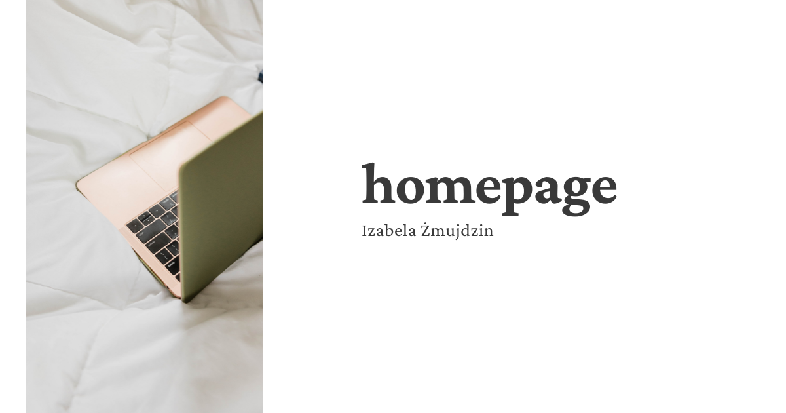

# Homepage 

About me and learning 'WTF co ten frontend'

## Training notes 

**Tydzień I**

Tydzień I to wprowadzenie do tego co będziemy robić i czego się uczyć. Już nie mogę się doczekać!

 **Tydzień II**

W tym tygodniu nauczyłam się podstaw HTML i dowiedziałam się czym są style CSS. 
Poznałam również takie narzędzie jak validator i codepen-do podzielenia się kodem z innymi 
Aby nie zaśmiecać HTMLa kodem CSS tworzy się oddzielny plik .css i w znaczniku head wstawia link href= „style.css” rel=”stylesheet" type”text/css" 
Style jakie poznałam to: color i background

**Tydzień III**

W tym tygodniu poznałam narzędzie do planowania pracy, metodę KANBAN, która dzieli zadania na: todo, doing i done. DO tej metody używamy programu trello. 
Poznałam nowe znaczniki HTML tj: b, i strong, które pogrubiają, oraz i, em, które pochylają. Strong i em, mają znaczenie semantyczne. 
Nauczyłam się także robić nawigacje wewnętrzną, zewnętrzną i dodawać zdjęcie. 
Lekcja 4 dotyczyła sposobów nazewnictwa, które często sprawiają sporo problemów...
